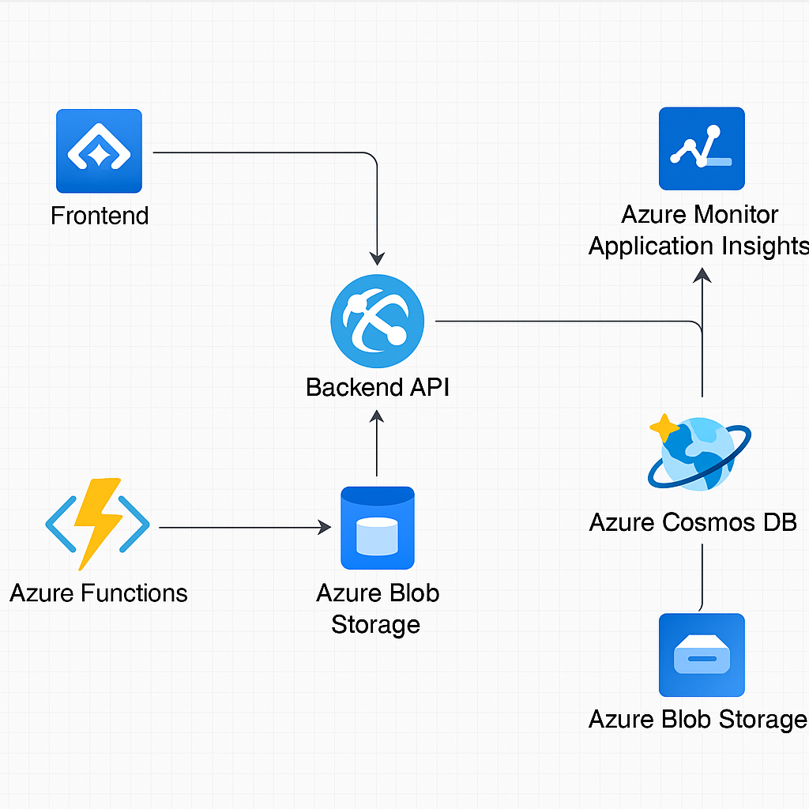

# Aplicação de Aluguel de Carros Cloud-Native 🚗☁️

Este projeto demonstra a arquitetura de uma aplicação moderna e escalável de aluguel de carros utilizando apenas serviços gerenciados da nuvem Microsoft Azure.

## 🧭 Diagrama da Arquitetura

## 🛠️ Componentes da Solução

- **Azure Static Web Apps**: Frontend moderno em React/Angular/HTML
- **Azure App Service**: Backend com APIs REST para manipular aluguéis, clientes e veículos
- **Azure Cosmos DB**: Banco de dados NoSQL para persistência escalável
- **Azure Blob Storage**: Armazenamento de imagens dos carros
- **Azure Functions**: Processos assíncronos (ex: envio de e-mail de confirmação)
- **Azure Monitor + Application Insights**: Monitoramento completo e rastreamento de logs

## 📸 Print Simulado

Abaixo, uma simulação de como o painel de monitoramento e recursos poderia aparecer no Azure.

## 📘 Aprendizados

Neste projeto, aprendi:
- A compor aplicações modernas com serviços nativos da nuvem
- Como usar funções serverless para automatização
- Como monitorar uma aplicação distribuída com Azure Monitor
- A utilizar banco de dados escalável com Cosmos DB

